<div align="center">
  <a href="#"></a>
</div>
<div align="center">
 <h2>Batch Pipeline - NYC Taxi Data Processing, Analysis, and Visualization</h2>
</div>

> [!IMPORTANT]
> :exclamation: Important Note :exclamation:	When running this project locally, ensure you have the necessary data files and environment variables set up as described in the installation guide.

<div>
    <h2>Table of Contents</h2>
    <ol>
        <li><a href="#introduction">Introduction</a></li>
        <ul>
            <li><a href="#description">Description</a></li>
            <li><a href="#goal">Goal</a></li>
        </ul>
        <li><a href="#technologies-libraries-tools-and-architecture">Technologies, Libraries, Tools and Architecture</a></li>
        <ul>
            <li><a href="#technologies-and-libraries">Technologies and Libraries</a></li>
            <li><a href="#tools">Tools</a></li>
            <li><a href="#architecture">Architecture</a></li>
        </ul> 
        <li><a href="#data">Data</a></li>
        <li><a href="#use-case---example">Use Case - Example</a></li>
        <li><a href="#installation-guide">Installation Guide</a></li>
        <li><a href="#bugs-and-feature-request">Bugs and Feature Requests</a></li>
        <li><a href="#license">License</a></li>
    </ol>
</div>

## Introduction
### Description:
The NYC Taxi Data Engineering project is a batch pipeline designed to ingest, process, and visualize NYC Taxi Trip data. The utilization of various microservices, including PostgreSQL, Apache Spark, Apache Airflow, and Apache Superset, all of which are containerized using docker, ensures scalability, security, maintainability, and monitoring.

### Goal:
The goal of the project is to provide a comprehensive batch pipeline specifically for telematics data from NYC taxis, enabling users to derive insights and make data-driven decisions or integrate a ML application. The project aims to facilitate an in-depth understanding of the usage of multiple microservices and their role and operations for creating a batch pipeline.

## Technologies, Libraries, Tools and Architecture
### Technologies and Libraries:
<details close>
<summary>Docker Microservices</summary>
    <ul>
        <li>Apache Airflow</li>
        <li>Apache Spark</li>
        <li>Apache Superset</li>
        <li>PostgreSQL</li>
    </ul>
</details>
<details close>
<summary>Additional Python Packages</summary>
    <ul>
        <li>PySpark</li>
        <li>psycopg2</li>
        <li>psycopg2-binary</li>
        <li>apache-airflow-providers-apache-spark</li>
        <li>python-dotenv</li>
    </ul>
</details>

### Tools

<ul>
    <li>Postman for Superset API testing</li>
    <li>Docker Desktop</li>
    <li>IDE: VS Code</li>
</ul>

### Proposed Architecture
<div align="center">
  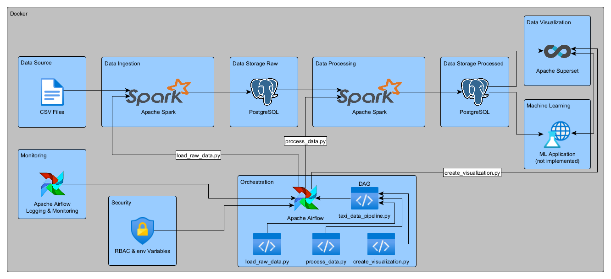
</div>

## Data

The chosen Data is gathered from the official [NYC Taxi & Limousine Commission](https://www.nyc.gov/site/tlc/about/tlc-trip-record-data.page) website.

It contains the following information:

| Field Name  | Description |
| ------------- | ------------- |
| VendorID  | A code indicating the provider that provided the record. (1= Creative Mobile Technologies, LLC; 2= VeriFone Inc.)  |
| tpep_pickup_datetime  | The date and time when the meter was engaged.  |
| tpep_dropoff_datetime  | The date and time when the meter was disengaged.  |
| Passenger_count  | The number of passengers in the vehicle.  |
| Trip_distance  | The elapsed trip distance in miles reported by the taximeter.  |
| PULocationID  | TLC Taxi Zone in which the taximeter was engaged ([locationId.pdf](https://github.com/NaBo-00/data_engineering/blob/master/img/locationId.pdf))  |
| DOLocationID  | TLC Taxi Zone in which the taximeter was disengaged ([locationId.pdf](https://github.com/NaBo-00/data_engineering/blob/master/img/locationId.pdf)) |
| RateCodeID  | The final rate code in effect at the end of the trip. 1= Standard rate; 2=JFK; 3=Newark; 4=Nassau or Westchester; 5=Negotiated fare; 6=Group ride  |
| Payment_type  | A numeric code signifying how the passenger paid for the trip. 1= Credit card; 2= Cash; 3= No charge; 4= Dispute; 5= Unknown; 6= Voided trip  |
| Fare_amount  | The time-and-distance fare calculated by the meter.  |
| Extra  | Miscellaneous extras and surcharges. Currently, this only includes the $0.50 and $1 rush hour and overnight charges.  |
| MTA_tax  | $0.50 MTA tax that is automatically triggered based on the metered rate in use.  |
| Improvement_surcharge  | $0.30 improvement surcharge assessed trips at the flag drop. The improvement surcharge began being levied in 2015.  |
| Tip_amount  | Tip amount – This field is automatically populated for credit card tips. Cash tips are not included.  |
| Tolls_amount  | Total amount of all tolls paid in trip.  |
| Total_amount  | The total amount charged to passengers. Does not include cash tips.  |
| Congestion_Surcharge  | Total amount collected in trip for NYS congestion surcharge.  |
| Airport_fee  | $1.25 for pick up only at LaGuardia and John F. Kennedy Airports  |

## Use Case - Example

Lets imagine that the data is generated and made available at the end of every month by the Taxi & Limousine Commision. 
The pipeline will run on the first day of every month. However, examplary lets consider the "yellow_tripdata_2023_06.csv" data.

For testing the below represented pipeline will be triggered manually.

> [!IMPORTANT]
> :exclamation: Important Note :exclamation:	The pipeline chooses the latest uploaded data file from the data/ directory in order to run the pipeline

<div align="center">
  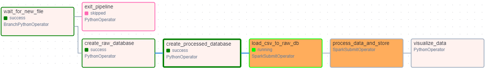
</div>

As can be seen above there are two paths:
- no need for processing and visualization
- need for processing and visualization

Path 1:
- If the latest uploaded data file name from the data/ directory does not align with the naming convention "yellow_tripdata_YYYY_MM.csv" or e.g., the file with "yellow_tripdata_2023_06.csv" was already processed and existing database entries and visualization where identified, there is no need to run the pipeline again for that data.

    <div align="center">
    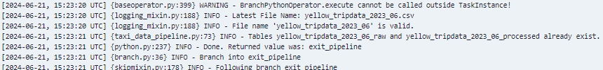
    </div>

Path 2:
- If the the latest uploaded data file name from the data/ directory follows the naming convention and e.g., the file with "yellow_tripdata_2023_06.csv" has not been processed yet it will run trough all tasks defined in the DAG.

    <div align="center">
    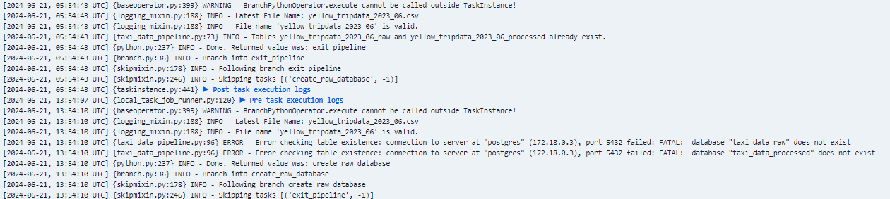
    </div>

- These Tasks include:
    - creating a postgreSQL database for the raw data

    <div align="center">
    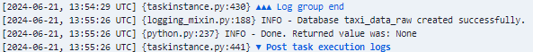
    </div>

    - creating a postgreSQL database for the processed data

    <div align="center">
    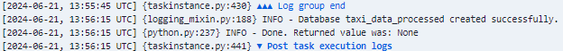
    </div>

    - load the raw data into the raw postgreSQL database

    <div align="center">
    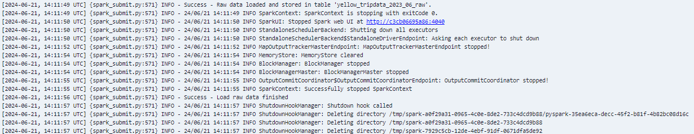
    </div>

    - process the data and then load them into the processed postgreSQL database

    <div align="center">
    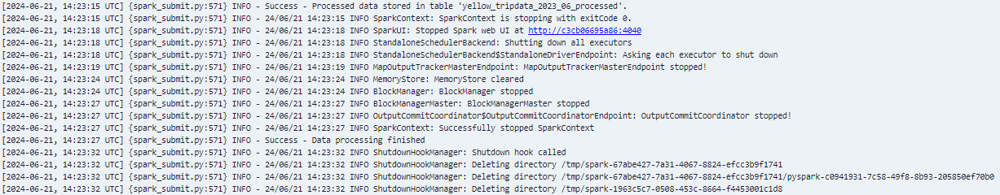
    </div>

    - Visualize the data by creating charts and diagrams

    <div align="center">
    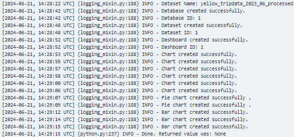
    </div>

    - Potential Superset Dashboard with the newly created charts and diagrams

    <div align="center">
    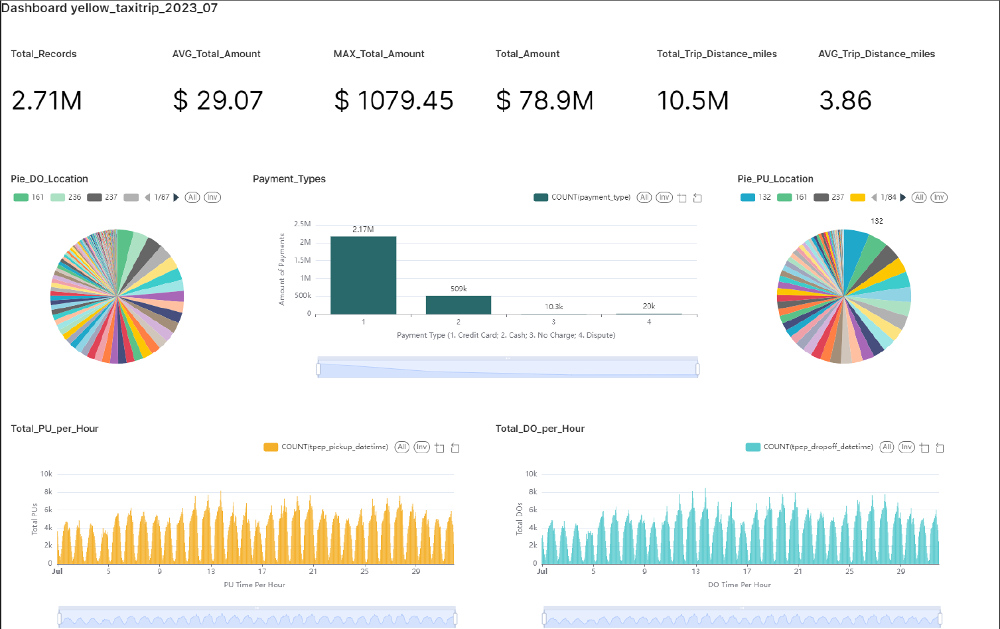
    </div>

    - Monitor Pipeline Runs - Overview

    <div align="center">
    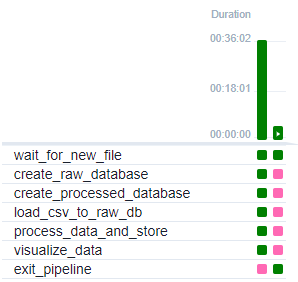
    </div>

## Installation Guide

> [!NOTE]  
> To clone and run this application, you'll need Git and Docker installed on your computer.

Read the [LICENSE.md](https://github.com/NaBo-00/data_engineering/blob/master/LICENSE) document for information about the licensing of this project.

<ol>
<li>Choose a location for the project and open the command line.</li><br>

<li>Install git Large File Storage</li>

```git lfs install```

<li>Clone the repository from GitHub:</li>

```git clone https://github.com/NaBo-00/data_engineering.git```

<li>Navigate to your newly cloned project directory: </li>

```cd data_engineering```


<li>Pull large data files: </li>

```git lfs pull```

<li>Unzip the data from the data_examples folder and move the data file you want to run the pipeline with inside the data/ directory: </li>

- Extract Data from zip
    - Mac:
    ```cd data_examples && unzip taxi_data_examples.zip```

    - Win:
    ```cd data_examples && tar -xf taxi_data_examples.zip```

- Drag and Drop the required data file inside the data/ directory or use the following command:
    - Mac:
    ```cd data_examples && mv yellow_tripdata_YYYY_MM.csv ../data```
    
    - Win:
    ```cd data_examples && move yellow_tripdata_YYYY_MM.csv ../data```  

<li>Set up a .env file in the root directory by renaming the ".env.example" file to ".env" and adding the necessary environment variables.</li>
    
> [!NOTE] 
> If you are using a mac ensure that the init_superset.sh is executable using this command: 

```cd superset && chmod +x init_superset.sh```
    
<li>Build and start the Docker containers:</li>

```docker-compose up -d```

<li>Ensure that all configurations are correct and the services are running by accessing airflow in your web browser at http://localhost:8088, superset in another web browser or incognito window at http://localhost:8089 and logging into the services using your previously defined credentials.</li>

> [!Important]
> When logging into airflow the first time you need to activate the "taxi_data_pipeline.py" DAG by toggling its slider button

<li>The pipeline is set to run "@monthly" in production, but it can easily be changed for testing purposes by setting the following variable to your prefered intervall e.g, "@daily" or a custom <a href="https://crontab.guru/">cronjob</a>. However the pipeline can also be triggered manually in the Aiflow UI:  </li>

- ```schedule_interval='@daily'  # Run Pipeline daily```<br>
- ```schedule_interval='0 */2 * * *' # Custom Cronjob: Run Pipeline every 2nd hour```
- > [!NOTE]  
    > After selecting a DAG you can trigger it manually by clicking the play button in the top right corner of the Airflow UI.
    
    </div>


</ol>

## Bugs and Feature Requests

If you find a bug, kindly open an issue [here](https://github.com/NaBo-00/data_engineering/issues/new) by including a description of your identified bug and steps to reproduce it.

If you would like to request a new feature, feel free to do so by opening an issue [here](https://github.com/NaBo-00/data_engineering/issues/new). Please include a description of your required functionalities and the expected outcome.

## License:

This project is licensed under the MIT License. Please refer to the [LICENSE.md](https://github.com/NaBo-00/data_engineering/blob/master/LICENSE) file for details.

----------------------

Project: https://github.com/NaBo-00/data_engineering

Made by NaBo-00 | Copyright (c) NaBo-00

<div></div>